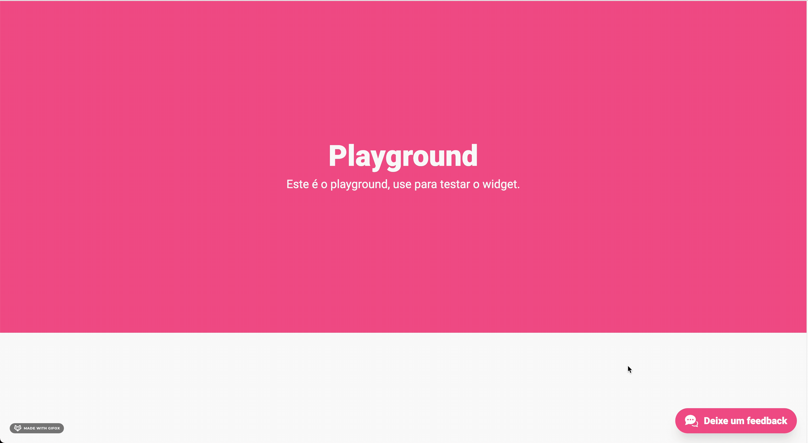

<p align="center">
    
</p>

<p align="center">
  
  
  
  
  
  
  
  
</p>

***

## Description: :star:

<p>This project has the objective of the show a dashboard with the feedbacks sent by the user through a widget</p>
<p>This project is based on a course of vuejs by <a href="https://treinamento.vuejsbrasil.org/">treinamento de Vue.js 3</a></p>

***

<p align="center">
  <a href="#demo-red_circle">Demo</a>&nbsp;&nbsp;&nbsp;|&nbsp;&nbsp;&nbsp;
  <a href="#backend-gear">Backend</a>&nbsp;&nbsp;&nbsp;|&nbsp;&nbsp;&nbsp;
  <a href="#dashboard-bar_chart">Dashboard</a>&nbsp;&nbsp;&nbsp;|&nbsp;&nbsp;&nbsp;
  <a href="#widget-dart">Widget</a>&nbsp;&nbsp;&nbsp;|&nbsp;&nbsp;&nbsp;
  <a href="#technologies-boom">Technologies</a>
</p>

***

## Demo: :red_circle:
**Widget**:


**Dashboard**:


***

## Backend: :gear:
The folder of the backend manages all manipulation of requests to the database and the creating user, generate a new token of access, list of feedbacks.

The structure of the backend is ready.

Before of run the commands, installed in your system the <a href="https://www.docker.com/get-started">**Docker**</a>.To run of backend use the commands below:

**install the dependencies:**
```sh
$ npm i or yarn
```
**build the backend in a container of docker:**
```sh
$ npm run build or yarn build
```
**run container created:**
```sh
$ npm run container or yarn container
```

This backend run on port ```3000```

***

## Dashboard: :bar_chart:
The folder of the dashboard is responsible to manage the visual part of the application, creating a list of feedbacks with a filter personalized to what the user can interact

Before of run the commands, installed in your system the <a href="https://vuejs.org/">**vuejs**</a>.To run of dashboard use the commands below:

**install the dependencies:**
```sh
$ npm i or yarn
```
**run application local or developer:**
```sh
$ npm run serve or yarn serve
```
**run tests unit:**
```sh
$ npm run test:unit or yarn test:unit
```
**run tests e2e:**
```sh
$ npm run test:e2e or yarn test:e2e
```
**run build to production:**
```sh
$ npm run build or yarn build
```

This dashboard run on port ```8080```

***
## Widget: :dart:
The folder widget is responsible to create an iframe using some information to create the widget correctly on the page of the client. This widget is used to get the feedback of the user and send the feedback to the dashboard where the owner of the page can access.

Before of run the commands, installed in your system the <a href="https://vuejs.org/">**vuejs**</a>.To run of widget use the commands below:

**install the dependencies:**
```sh
$ npm i or yarn
```
**run application local or developer:**
```sh
$ npm run serve or yarn serve
```
**run tests unit:**
```sh
$ npm run test:unit or yarn test:unit
```
**run tests e2e:**
```sh
$ npm run test:e2e or yarn test:e2e
```

This widget run on port ```8080```

***

## Technologies: :boom:
This project contains those technologies:

- [Nodejs](https://nodejs.org/en/)
- [Docker](https://www.docker.com/)
- [Vuejs](https://vuejs.org/)
- [jest](https://jestjs.io/)
- [cypress](https://www.cypress.io/)
- [tailwind](https://tailwindcss.com/)
- [vue-test-utils](https://vue-test-utils.vuejs.org/)

***

<br>

Made by Janapc :metal: [Get in touch!](https://www.linkedin.com/in/janaina-pedrina/)
